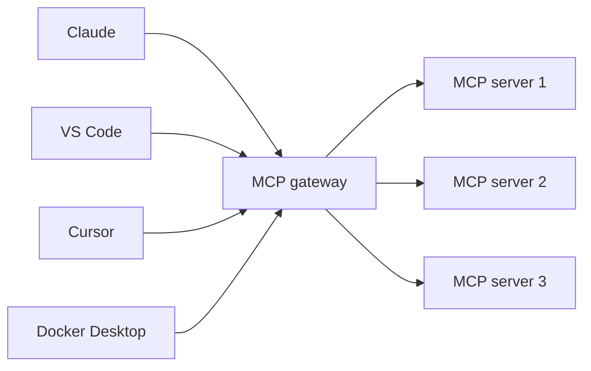
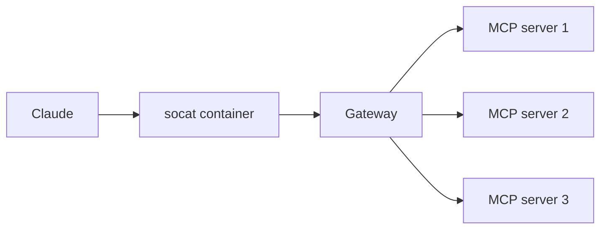

# MCP Gateways

Now that we've dived a little into MCP, let's close off with one final topic - MCP gateways.

What are MCP gateways and what problems are they trying to solve?

## Why MCP gateways?

When adding MCP servers, you currently have to configure each and every client to launch the MCP servers it wants to use. But, what happens if I'm using multiple clients? I might want to use the same tools for Claude, VS Code, Cursor, and Docker Desktop.

The idea of a MCP gateway is you add one MCP server to each of those and that that server acts as a proxy (or gateway) to the other tools.



With this setup, there are a few advantages:

1. **Better machine resource handling** - by using a gateway, you only need one instance of each tool running, rather than each client running their own set of tools
1. **Dynamic launching/shutdown** - the gateway can automatically start or stop the backing services as needed, rather than leaving them always up and running
1. **Centralized and secure credential management** - the gateway can manage and ensure required credentials are handled correctly and securely

## The Docker Desktop MCP gateway

The [AI Tool Catalog extension](https://open.docker.com/extensions/marketplace?extensionId=docker/labs-ai-tools-for-devs) provides the ability to run as a MCP gateway.

Since many MCP clients still expect to actually "launch" something, they are configured to run a small proxy that simply forwards requests to the gateway. This is the sample configuration to use when working with Claude:

```json
{
  "mcpServers": {
    "MCP_DOCKER": {
      "command": "docker",
      "args": [
        "run",
        "-i",
        "--rm",
        "alpine/socat",
        "STDIO",
        "TCP:host.docker.internal:8811"
      ]
    }
  }
}
```

This will then create the following architecture:



## Try it out

Your task is to enable the MCP gateway and give it a try yourself.

1. Install the [AI Tool Catalog extension](https://open.docker.com/extensions/marketplace?extensionId=docker/labs-ai-tools-for-devs), if you haven't yet done so

2. In the **MCP servers** tab, click the _Add Docker MCP Gateway_ button.

3. In the tool catalog, search for the **docker** tool and enable it.

    Note that it may take a moment for it to actually start since it needs to download the container image.

    Once it's ready, you should new tools automatically in the **Tools** tab.

4. Now, add messages that can use the new tools:

    ```custom message
    Can you start a nginx container, give it a name of your choice, and configure it so I can open it in my browser? After doing so, give me the localhost URL I can use to open it.
    ```

    And when you're done, you can simply request to have the container removed:

    ```custom message
    Can you remove the container now?
    ```