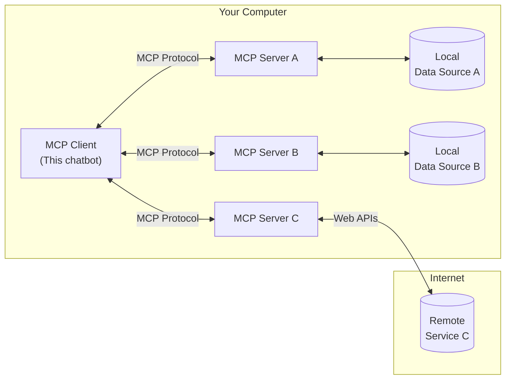

# Externalizing tools with MCP

As you're hopefully starting to see, tools start to really unlock the power of GenAI. No longer can it only answer questions, but it can build an execution path, execute tools, and complete work!

We'll try a few more examples in a few moments of other ideas too!

## What/why MCP?

For many teams that are getting started, they simply embed the tools directly in the codebase - "When we see `get-current-time`, call the function that gets the current time".

But, as tools become more complex, new questions arise such as:

- How do I share tools across LLM-backed applications?
- How do I setup more complex tools that need more dependencies, libraries, etc.?

With Model Context Protocol (MCP), external processes (called MCP Servers) can be used to expose tools, prompts, resources, and more. With this, your app can delegate the execution of tools to these MCP servers.

Additionally, these MCP Servers can then interact with any other systems that might be needed (databases, APIs, etc.).

