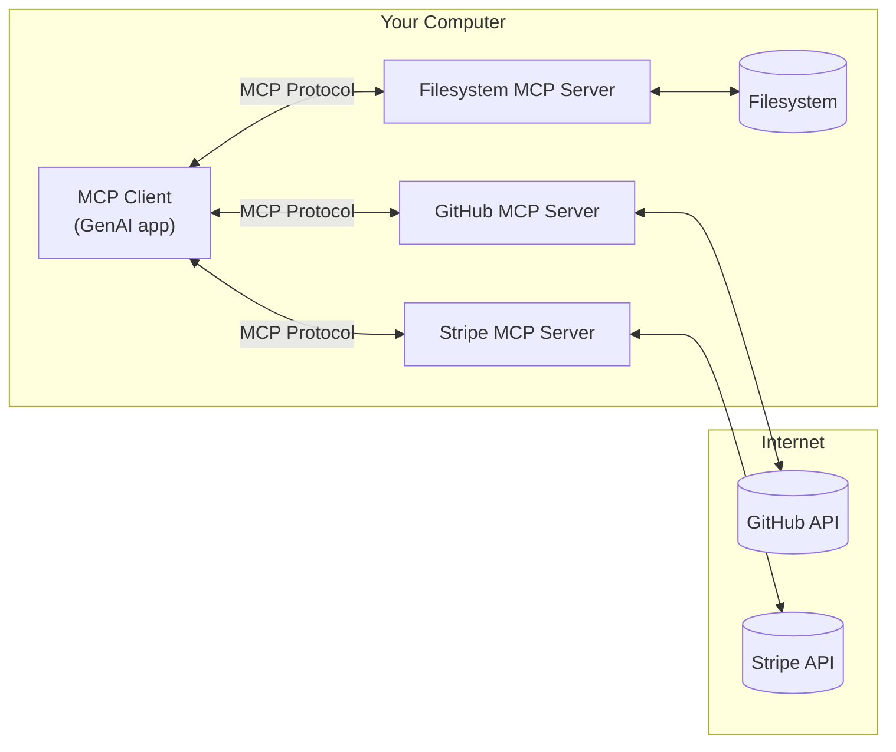
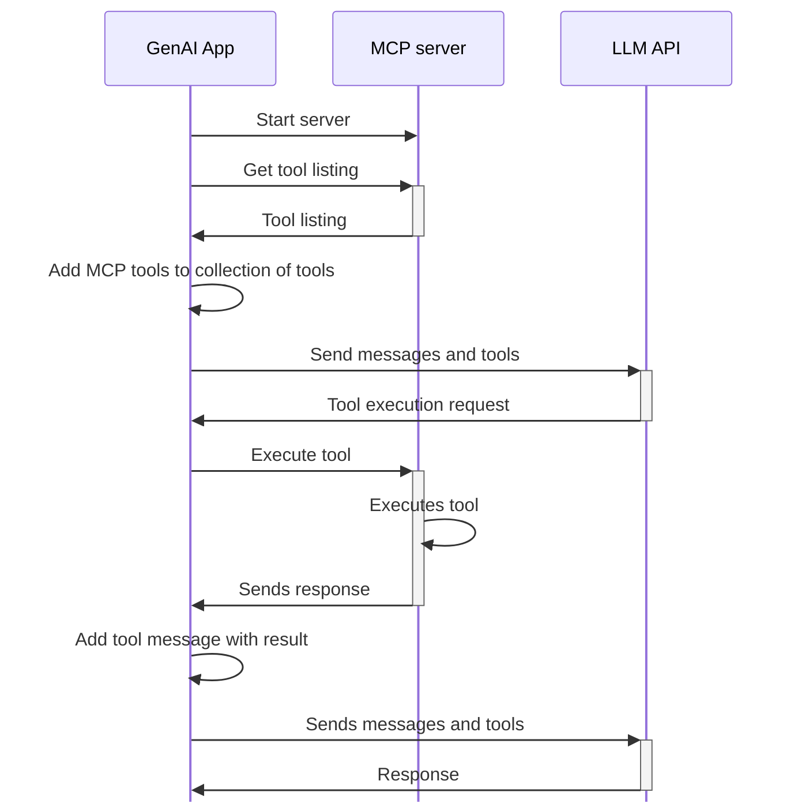

# Externalizing tools with MCP

As you're hopefully starting to see, tools start to really unlock the power of GenAI. No longer can it only answer questions, but it can build an execution path, execute tools, and complete work!

We'll try a few more examples in a few moments of other ideas too!

## What/why MCP?

Getting the current time is fairly easy to do, as it doesn't require a lot of code. But, imagine you wanted to distribute a set of tools or wanted to leverage someone else's tools. How would you do that?

As an example, imagine you wanted to query repos and issues from GitHub. While you could write your own tools to leverage the GitHub API, what if GitHub had a way to create their own tools and distribute them to you?

That's exactly why Model Context Protocol (MCP) was developed. It provides the ability to _externalize_ the tools from your GenAI app, but still allow them to be used by your app. You can simply delegate the running to these MCP servers.



## The updated tool flow

While we're not going to get too deep into the protocol, it is important to understand that the protocol enables a server to share a listing of its tools and execute a tool, amongst other things.

The app now performs the following tasks:

1. When starting up, the app will start all configured MCP servers
2. The app will get the available listing of tools from each MCP server and append those tools to the collection of tools that will be sent to the LLM API.
3. When it receives a tool execution request, it'll delegate the running of it to the appropriate MCP server.

That flow looks like the following diagram:



> [!info] Tool updates
> The MCP protocol also provides support for notifications, allowing a MCP server to notify a client when the list of tools has changed. This enables more dynamic situations where tools may be enabled/disabled dynamically (which we'll try in a moment!).


## Setting up MCP servers

As of today, most MCP clients fully manage the lifecycle of the MCP servers they are going to use. When the app starts, it launches the MCP servers. This is likely to change in the very near future, but we'll focus on this fully managed example first.

The configuration snippet below is an example of configuring Claude Desktop to run a MCP server that can provide the current time. When Claude starts, it'll run the specified command to start the MCP server, after which it will connect to it and get the listing of tools.

```json
"mcpServers": {
  "time": {
    "command": "uvx",
    "args": ["mcp-server-time"]
  }
}
```

### Current struggles with MCP

Many MCP servers currently leverage `uvx`, which is a Python-based tool that helps setup a Python environment and start a specified application. But, this approach has a few trade-offs, including:

- **Runtime setup** - you need to have Python and `uvx` installed on the machine. Not a huge deal, but what if the app needs a different version than what you have installed? Or what if another MCP server uses Java or Node instead of Python?
- **Lack of isolation** - a malicious MCP server has access to the entire machine. Having a LLM control the execution may not be the best for security

### Using containers to run MCP servers

Many of these same lessons have already been learned and solved before... use containers! They are language-agnostic and standardize packaging and distribution of applications.

Fortunately, we're starting to see a rise of container-based MCP servers. In fact, [GitHub's official MCP server](https://github.com/github/github-mcp-server) recommends the following configuration to run its server in Claude:

```json
{
  "mcpServers": {
    "github": {
      "command": "docker",
      "args": [
        "run",
        "-i",
        "--rm",
        "-e",
        "GITHUB_PERSONAL_ACCESS_TOKEN",
        "ghcr.io/github/github-mcp-server"
      ],
      "env": {
        "GITHUB_PERSONAL_ACCESS_TOKEN": "<YOUR_TOKEN>"
      }
    }
  }
}
```

Notice that this uses a `docker run` command, which will start the MCP server in a container. You no longer need to install any other tooling, manage versions, or worry about host isolation.


## Your task

This app contains a few easy-to-install MCP servers in the **MCP servers** tab.

1. Before enabling a MCP server, add the following message:

    ```custom message
    Are there any current weather advisories in Chicago?
    ```

    You might get an answer, but remember that it might be answering based on the data the model was trained with. If an advisory exists, you can follow it up for the date of the advisory to confirm.

2. In the **MCP servers** tab, click the _Add weather server (local)_ button. This will start a MCP server using Node (not in a container). Then, ask the same question.

    - Now, you'll see the tool execution run, which will leverage the weather MCP server

3. In the **MCP servers** tab, click the _Add sqlite server_ button. This MCP server uses the `mikesir87/mcp-sqlite-demo` container image, which exposes tools to interact with a built-in sqlite database.

4. Add a message that asks about the details of the database.

    ```custom message
    Tell me about my database, including the table names and how many rows are in each table.
    ```

    After it gives you a summary, ask it to get the URL for the meme about Boromir. See if it can figure it out.

    ```custom message
    Give me the URL for the meme about Boromir
    ```
