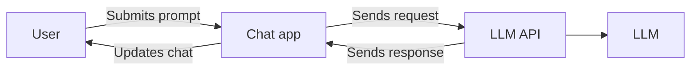
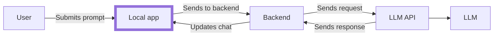

# Message basics

This may be a "hot take", but here goes:

> [!warning] Hot take!
> Creating LLM-based applications isn't _that_ different than any other application.

Why? Well, you're simply interacting with an API. Requests go in, some LLM magic happens, and responses come back out. The only difference is the responses are _very_ likely to be different every time, even with the exact same inputs.

## The LLM API

One of the things OpenAI did is they created an API specification around their LLMs, which many of the other LLM providers are now following this schema (including the Docker Model Runner).

This abstraction layer API makes it easy to interact with models without having to worry about loading/unloading models, formatting data, etc.

For a web-based chat application, that flow looks something like this:



For local GenAI-enabled apps (like VS Code, Claude Desktop, Docker Desktop, etc.), there is usually an extra step in which there is a local client that works with a backend API.



Now that we understand that, let's dive in and understand what's actually being sent in the messages sent to the LLM API.

We'll start off with the "Chat Completions" endpoint


## The chat completions endpoint

The `/v1/chats/completion` endpoint ([full docs here](https://platform.openai.com/docs/api-reference/chat/create)) allows you to "create a model response for a given chat conversation."

The endpoint requires two fields:

- `model`: your intended model
- `messages`: a collection of the messages for the conversation up to this point

Each `message` contains, at a minimum, two properties:

- `role`: the role of the message (more on that in a moment)
- `content`: the content of the message

The example below (which you can try yourself!) sends a request to the LLM, specifying your current model ({{MODEL}}) and two messages. We'll talk about the different messages in just a moment.

```json with-copy highlight=5-15
curl -v {{ENDPOINT}} \
    -H "Content-type: application/json" \
    -X POST --data-raw '
{
  "model": "{{MODEL}}",
  "messages": [
    { 
      "role": "system", 
      "content": "You are a helpful assistant. Blah blah..." 
    },
    { 
      "role": "user", 
      "content": "Hello!"
    }
  ]
}'
```

After sending this request, we'll get a response that will contain quite a few things including tokens used and some other metadata.

The main response we're after is embedded in the `choices` property. You may notice this field looks like a message we say earlier because it is!

But, you'll notice that the `role` of the message has a value of **assistant** (more on that in a moment):

```json highlight=9-12
{
  "id": "chatcmpl-123",
  "object": "chat.completion",
  "created": 1677652288,
  "model": "gpt-4o-mini",
  "system_fingerprint": "fp_44709d6fcb",
  "choices": [{
    "index": 0,
    "message": {
      "role": "assistant",
      "content": "\n\nHello there, how may I assist you today?",
    },
    "logprobs": null,
    "finish_reason": "stop"
  }],
  "service_tier": "default",
  "usage": {
    "prompt_tokens": 9,
    "completion_tokens": 12,
    "total_tokens": 21,
    "completion_tokens_details": {
      "reasoning_tokens": 0,
      "accepted_prediction_tokens": 0,
      "rejected_prediction_tokens": 0
    }
  }
}
```

### Message roles

Now that we've seen a few different "roles" of messages, let's dive into what the roles mean. The "role" of a message specifies the type of the message and how it should be handled by the LLM. The roles we've seen so far include:

- **system** (sometimes called **developer**) - information on how the LLM should operate. What is its persona? What are the rules of engagement? How should the LLM structure responses? What are things it must or must never do?
- **user** - messages sent by the user. These are typically the messages typed in the chat interaction or through other mechanisms.
- **assistant** - messages generated by the AI assistant (like we see in the response)

We'll talk about a fourth type called **tool** in a little bit. But, now it's your turn to try things out a little bit!


## Your task

For this step of the tutorial, your goal is to get familiar with messages.

In the message view, you'll see a default system message that has already been specified. When you add a message, the stack of messages will be sent to the API.

1. Add a few `user` messages and get results from the API.
2. Click on any message to view the raw message details, including its role and content.
3. Adjust the System Prompt and see how the flow of the conversation changes. You can do so by going to **Settings** -> **System prompt**.