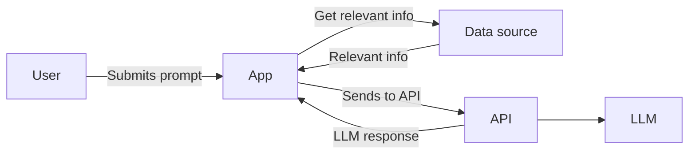
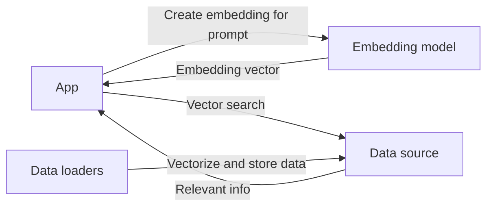

# RAG (Retrieval Augmented Generation)

If we think of models as a "snapshot of knowledge", it means that snapshot is current only up to a specific point in time. So, how does it answer questions about recent events or data that's always changing?

To solve that, Retrieval Augmented Generation (often shortened to RAG) was developed.

Simply put, RAG is the idea of finding additional information and simply adding more data to the `user` message before sending it to the LLM.

In the flowchart below, we see one modification to the flow. Before the collection of messages is sent to the API, the app looks up relevant information from a data source. The relevant information is then packed into the messages.



As an example, let's try sending the LLM the following user message:

```custom message
When was the Docker Model Runner released?
```

You'll probably notice that the answer is... well... inaccurate. To solve this, we can simulate RAG by adding additional context to the prompt.

In the following message, we add additional context with the user prompt:

```custom message
User prompt: When was the Docker Model Runner released?
-_-_-_-_-_-_-_-_-_-_-_-_
Additional context:

Blog post: Introducting Docker Model Runner: A Better Way to Build and Run GenAI Models Locally
Date: Apr 9, 2025
Summary: Docker Model Runner is a faster, simpler way to run and test AI models locally, right from your existing workflow.
Excerpt: Generative AI is transforming software development, but building and running AI models locally is still harder than it should be. Today’s developers face fragmented tooling, hardware compatibility headaches, and disconnected application development workflows, all of which hinder iteration and slow down progress.  

That’s why we’re launching Docker Model Runner — a faster, simpler way to run and test AI models locally, right from your existing workflow. Whether you’re experimenting with the latest LLMs or deploying to production, Model Runner brings the performance and control you need, without the friction.

We’re also teaming up with some of the most influential names in AI and software development, including Google, Continue, Dagger, Qualcomm Technologies, HuggingFace, Spring AI, and VMware Tanzu AI Solutions, to give developers direct access to the latest models, frameworks, and tools. These partnerships aren’t just integrations, they’re a shared commitment to making AI innovation more accessible, powerful, and developer-friendly. With Docker Model Runner, you can tap into the best of the AI ecosystem from right inside your Docker workflow.
```

Now, the answer is much more accurate. It's the same original prompt from the user, but now has been packaged with additional information to help the LLM be more accurate in its response.

While this example was fairly simulated, let's take a quick look at how it's typically done.


## The data stores

In the case of a chatbot-like interaction, users are entering their questions in natural language, which requires an ability to also lookup data with natural language. 

One way to do this is by using vector-based searching. To do so, we first create embeddings for the prompt, which converts the text into a large numerical vector that captures the semantic reasoning of the text. With that vector, we can search for relevant data that has also been vectorized.

What types of data can you store? Well, that's up to you! It might be product information, documentation, knowledge base articles, support emails, or anything else.

The full process looks like this:



For example, using the prompt `Tell me about the Docker Model Runner` is converted into the following embedding vector using the `mxbai-embed-large` model (it's a vector of 1024 dimensions!):

```json
"embedding": [
  0.04175844416022301, -0.001338763628154993, -0.029847711324691772, -0.04572378844022751, 0.010485759004950523, 0.03291919827461243, 0.016764862462878227, 0.0030360836535692215, 0.031130196526646614, 0.0625055730342865, 0.0010806831996887922, -0.008533458225429058, -0.002970408881083131, -0.028841102495789528, -0.00576156098395586, 0.02160670794546604, 0.024778228253126144, -0.044642724096775055, -0.08230464160442352, -0.014212334528565407, 0.06688565015792847, 0.00437538605183363, -0.05004061385989189, -0.03988656774163246, -0.045873429626226425, 0.019637014716863632, 0.015969961881637573, -0.012024233117699623, 0.06411406397819519, 0.020615050569176674, -0.007475211285054684, 0.031066905707120895, 0.0026180287823081017, -0.029495909810066223, -0.014568607322871685, -0.009549449197947979, -0.0033398615196347237, -0.017325829714536667, -0.009319731034338474, -0.054105326533317566, 0.03153840824961662, -0.03133823722600937, 0.023123139515519142, -0.02213292382657528, -0.02177511155605316, -0.007825794629752636, 0.016160298138856888, 0.04207673296332359, -0.018445821478962898, -0.00372977158986032, -0.007202972192317247, 0.03707004711031914, 0.004435844253748655, -0.025375816971063614, -0.036066748201847076, -0.010899112559854984, -0.04615427926182747, 0.023449834436178207, -0.05605397745966911, 0.01929735578596592, 0.02849801443517208, -0.002976586576551199, -0.013392276130616665, -0.05962439998984337, 0.03253990411758423, 0.0744604840874672, 0.003013924928382039, -0.0051225158385932446, -0.0032769294921308756, 0.007767161354422569, -0.02694937400519848, 0.025086432695388794, -0.006132917478680611, -0.02788969688117504, -0.018401013687253, 0.04625450819730759, 0.05401201546192169, 0.018666962161660194, 0.026578355580568314, 0.021041860803961754, 0.0067709656432271, 0.06338829547166824, 0.007162465248256922, 0.0048792604357004166, -0.03621634840965271, -0.025248639285564423, 0.019968228414654732, -0.027788417413830757, -0.007510462775826454, -0.01543123833835125, -0.023686500266194344, 0.04723142459988594, 0.01364926528185606, 0.036448366940021515, -0.004407844506204128, 0.01925155147910118, -0.026999320834875107, 0.01848696358501911, 0.0408816821873188, 0.014189641922712326,
  0.01151333935558796, 0.056184638291597366, -0.03859907388687134, -0.04114379361271858, -0.034760359674692154, 0.010080786421895027, 0.03186068311333656, 0.021947158500552177, -0.04532980918884277, -0.030990831553936005, 0.041499920189380646, 0.0012546025682240725, -0.02125619538128376, 0.008386430330574512, -0.0007069120183587074, -0.019878165796399117, 0.011357858777046204, -0.016405543312430382, -0.02741108648478985, -0.022475671023130417, 0.0026801489293575287, -0.0021333585027605295, 0.015245028771460056, -0.05878238007426262, -0.0016780991572886705, -0.026029104366898537, -0.040633004158735275, 0.07435976713895798, -0.005436759442090988, 0.023130204528570175, -0.009498165920376778, -0.014314884319901466, 0.017261158674955368, 0.003792654722929001, -0.001352386549115181, 0.017272694036364555, -0.0024927423801273108, 0.03982249274849892, 0.06172005087137222, -0.006775995716452599, 0.010126970708370209, -0.01622699946165085, 0.0284095611423254, 0.07692603766918182, -0.0014260815223678946, 0.00664376188069582, 0.006749499123543501, -0.009646507911384106, -0.016461873427033424, 0.038054704666137695, -0.007883451879024506, 0.0021093578543514013, -0.01740243099629879, -0.0022706168238073587, 0.008454013615846634, 0.033323921263217926, -0.041119370609521866, 0.021816430613398552, 0.0086960569024086, 0.01747235842049122, -0.015662923455238342, -0.02895052544772625, 0.010416615754365921, 0.019344331696629524, -0.03109557181596756, 0.0304079782217741, -0.004736848175525665, -0.000669992936309427, -0.02484727092087269, 0.013864110223948956, 0.005042709410190582, -0.03656488656997681, -0.0018760811071842909, 0.016622211784124374, 0.0242414940148592, 0.009952740743756294, -0.007664010394364595, 0.03431551903486252, 0.020179033279418945, 0.018150508403778076, -0.029640372842550278, -0.03520531207323074, 0.023279186338186264, 0.044659510254859924, -0.02119062840938568, 0.026783520355820656, 0.030463658273220062, -0.001464449567720294, -0.05138740316033363, -0.001429373282007873, -0.0007869069813750684, 0.0728796124458313, -0.0426744781434536, -0.005370271857827902, -0.0019180586095899343, -0.019300172105431557, -0.011570132337510586, 0.01487620361149311, -0.03272499889135361, -0.02499096654355526, -0.02168358862400055, 0.017221849411725998, -0.028882751241326332, 0.0035814358852803707, 0.002015427453443408, 0.002618267899379134, -0.01836659573018551, 0.027925798669457436, -0.05064009130001068, -0.011991425417363644,
  0.07487256824970245, -0.012376231141388416, -0.04093463346362114, -0.058698203414678574, 0.03514536842703819, -0.014911140315234661, -0.008867172524333, -0.0003476194979157299, -0.007872195914387703, 0.007785514462739229, 0.01870560832321644, -0.00202039978466928, 0.028220070526003838, 0.008381681516766548, 0.014255314134061337, -0.04415839910507202, -0.02236536704003811, 0.01909167692065239, 0.03613284230232239, 0.00801035575568676, 0.004266122821718454, 0.022766556590795517, -0.013004537671804428, 0.021708006039261818, 0.027328399941325188, 0.01597585715353489, 0.047602035105228424, 0.023004254326224327, -0.042146697640419006, 0.029627174139022827, 0.00795266404747963, 0.05091356113553047, 0.007971186190843582, 0.016278723254799843, 0.03603322431445122, -0.042174264788627625, -0.016919411718845367, 0.0019231709884479642, -0.0271122008562088, 0.03774876147508621, -0.04607501998543739, 0.0064439717680215836, 0.012166989035904408, -0.043581895530223846, -0.00729880016297102, -0.00240509700961411, -0.025607608258724213, 0.011083472520112991, -0.05226590111851692, -0.0066223847679793835, 0.019793275743722916, -0.00800233893096447, -0.02202284149825573, -0.04931626841425896, 0.001195285702124238, 0.05703756958246231, -0.010506474412977695, -0.009598979726433754, -0.006043653003871441, -0.003654713975265622, -0.010976620949804783, 0.011954112909734249, -0.08834683895111084, -0.03551303595304489, -0.02688535861670971, 0.041561275720596313, -0.027237404137849808, 0.019117658957839012, 0.007104142103344202, -0.04811011999845505, -0.015802185982465744, 0.010765540413558483, 0.025459356606006622, 0.020824041217565536, -0.02148927003145218, -0.028155839070677757, -0.0445072203874588, -0.00315329828299582, -0.06691085547208786, -0.011176594533026218, -0.043890565633773804, 0.034843217581510544, 0.007444644812494516, -0.03143481910228729, 0.005188738461583853, -0.007833488285541534, -0.014302724972367287, -0.013579463586211205, -0.009394552558660507, -0.009218602441251278, -0.04901745170354843, -0.033362168818712234, 0.029468324035406113, -0.03689686208963394, 0.02146890200674534, 0.036229249089956284, 0.019398128613829613, -0.03058456815779209, 0.05437081307172775, 0.03287383168935776,
  0.001735779456794262, 0.015890713781118393, -0.02523653954267502, 0.033111028373241425, -0.035331763327121735, 0.08230888843536377, 0.06772061437368393, -0.016815045848488808, -0.043785031884908676, -0.01154719665646553, 0.011069606989622116, -0.013365800492465496, -0.003316114190965891, -0.02388528734445572, -0.042685456573963165, 0.036786921322345734, 0.017376350238919258, -0.03489336371421814, 0.007883523590862751, 0.018197475001215935, 0.021464860066771507, -0.011416330002248287, 0.0007766286726109684, 0.004051602445542812, -0.0034285844303667545, 0.07390695810317993, -0.027367357164621353, -0.009991361759603024, 0.0033419718965888023, 0.025294415652751923, -0.004552148282527924, 0.008052302524447441, 0.002756707835942507, 0.024278096854686737, -0.02406298741698265, -0.02544708363711834, 0.04520935192704201, -0.05462193116545677, 0.03958064690232277, -0.026545535773038864, -0.04181332141160965, -0.008713681250810623, -0.01027818862348795, -0.01545235700905323, 0.02102017216384411, 0.046519119292497635, -0.03668716922402382, 0.02754959464073181, -0.0019359589787200093, 0.032710958272218704, 0.04395534470677376, 0.04223822057247162, 0.025222178548574448, 0.004181845113635063, -0.022525092586874962, -0.0241151824593544, -0.02610602229833603, 0.027912026271224022, 0.06958633661270142, -0.05542519688606262, 0.035791102796792984, -0.019278040155768394, -0.027682453393936157, 0.019123993813991547, 0.0064058504067361355, -0.06446586549282074, 0.0014254358829930425, 0.03158144652843475, -0.0018997697625309229, -0.008920436725020409, -0.018618065863847733, 0.006880799774080515, 0.02301964722573757, 0.01786607876420021, 0.035617999732494354, 0.026157759130001068, -0.008935199119150639, -0.049765754491090775, -0.003384998068213463, -0.0489049032330513, -0.030030662193894386, -0.0002037400408880785, -0.025943104177713394, -0.010017002932727337, -0.04191740229725838, -0.06529349833726883, -0.00925719365477562, 0.0528801791369915, 0.06856045871973038, 0.02384234219789505, 0.054345469921827316, -0.037919070571660995, -0.01971774362027645, 0.02318653091788292, -0.012746991589665413, 0.029042569920420647, -0.025599710643291473, 0.02115630730986595, -0.0021399380639195442, -0.029518049210309982,
  -0.04962654039263725, -0.026305468752980232, 0.018670080229640007, 0.0577809140086174, 0.03186323493719101, -0.018757686018943787, -0.039195504039525986, 0.015455681830644608, 0.0007174152415245771, -0.015242953784763813, -0.01028879638761282, -0.04561877250671387, -0.021238725632429123, 0.023483367636799812, 0.05358003452420235, -0.0016140559455379844, 0.015849901363253593, -0.03286253660917282, 0.004734828136861324, 0.0065686278976500034, -0.051791295409202576, -0.058528244495391846, -0.006102653685957193, 0.00749034620821476, -0.061099130660295486, 0.08687049150466919, 0.014911371283233166, -0.021852148696780205, -0.03244059160351753, -0.011081565171480179, 0.02206921949982643, 0.010904454626142979, -0.004070214927196503, -0.02588031440973282, -0.011780438013374805, 0.002613782649859786, 0.04896038770675659, 0.003257268574088812, 0.01069018803536892, -0.006636440753936768, -0.019691726192831993, -0.007090558763593435, -0.03751260042190552, -0.045391716063022614, 0.017649659886956215, 0.021133968606591225, -0.01001253817230463, 0.006199725437909365, 0.04985274001955986, 0.03231680020689964, -0.021884864196181297, -0.003279893659055233, 0.06937102228403091, -0.03330773487687111, -0.06046575307846069, 0.03622899577021599, 0.00904171820729971, 0.0320429727435112, 0.04904741793870926, 0.021907638758420944, -0.053531866520643234, 0.028712598606944084, 0.03737485408782959, -0.00972569826990366, 0.02282833121716976, -0.009295170195400715, 0.013690981082618237, 0.04328570514917374, 0.01105873566120863, -0.00934245903044939, -0.0427062027156353, 0.06055158004164696, 0.011823383159935474, 0.01883213222026825, 0.018341369926929474, -0.037837155163288116, -0.028688419610261917, 0.009660101495683193, -0.012624960392713547, 0.02178431861102581, -0.004938748199492693, -0.0030674280133098364, 0.010150224901735783, -0.01804671436548233, 0.0002603555331006646, -0.013076286762952805, -0.0024752048775553703, 0.017546646296977997, 0.051916442811489105, 0.021561414003372192, 0.004613255150616169, -0.010565481148660183, -0.047515496611595154, 0.03409013897180557, -0.04871205985546112, -0.04204722121357918, 0.003647539298981428, 0.04281634837388992, 0.0436103492975235, -0.014397199265658855,
  -0.018466811627149582, -0.03818226605653763, -0.00015420337149407715, -0.012913444079458714, 0.033757831901311874, -0.0027922631707042456, -0.012875714339315891, -0.03658520430326462, -0.00955725647509098, -0.015554115176200867, 0.012168345041573048, -0.0603509396314621, -0.010897322557866573, 0.016712704673409462, 0.053175631910562515, 0.018471283838152885, 0.029998743906617165, -0.02791362814605236, -0.03703516721725464, -0.04874707758426666, 0.043645117431879044, -0.029936693608760834, -0.02245214208960533, -0.01073350291699171, -0.0635378509759903, -0.0019216504879295826, -0.025118021294474602, 0.039755865931510925, -0.04643092304468155, -0.00925279501825571, -0.021718930453062057, 0.0534965954720974, -0.04308079555630684, -0.028308453038334846, -0.03939613327383995, 0.01388551201671362, -0.015575484372675419, 0.07339757680892944, -0.014924958348274231, 0.005976909305900335, -0.012586379423737526, 0.043765418231487274, -0.019001604989171028, 0.05530887469649315, -0.011748239398002625, -0.017970390617847443, -0.01845211163163185, -0.040464695543050766, -0.007884379476308823, 0.03272773697972298, -0.03467639908194542, 0.017558498308062553, -0.005338757298886776, -0.016620326787233353, -0.04348606988787651, -0.024265967309474945, -0.02228066697716713, -0.025078248232603073, 0.01342736929655075, -0.01636805385351181, 0.033731646835803986, 0.017244430258870125, 0.02301129698753357, 0.018956826999783516, 0.016939127817749977, -0.020586417987942696, -0.028262909501791, -0.00593187939375639, -0.04910662770271301, 0.030267098918557167, -0.038187287747859955, -0.030103538185358047, -0.025223731994628906, 0.0015982320765033364, -0.0111335888504982, -0.022703928872942924, 0.002650095149874687, 0.03272387012839317, -0.0007469888078048825, 0.014120847918093204, -0.0641542449593544, 0.02679271809756756, 0.0028590664733201265, -0.02906160242855549, -0.00940192025154829, 0.009934033267199993, -0.05379035323858261, 0.006477026734501123, -0.035092391073703766, -0.06885061413049698, 0.007242471911013126, 0.04228927195072174, 0.013644023798406124, 0.02306230179965496, 0.013243387453258038, -0.003394604893401265, -0.01968887262046337, 0.00484279403463006, 0.025390008464455605, 0.056021787226200104,
  0.011130157858133316, 0.041185446083545685, 0.004961833823472261, 0.020285191014409065, 0.011962574906647205, 0.009482813067734241, -0.003940149676054716, -0.021918857470154762, 0.01205051876604557, -0.01764243096113205, -0.028599655255675316, 0.020080121234059334, 0.009449324570596218, -0.03549584373831749, -0.05115114524960518, -0.02985522523522377, -0.004405094776302576, -0.01459724921733141, -0.0034071102272719145, 0.026913482695817947, -0.03809477388858795, -0.03256253898143768, 0.03417753055691719, 0.007034262176603079, -0.009184347465634346, -0.003088126890361309, -0.015036509372293949, 0.01449882984161377, -0.02309997007250786, -0.007256772369146347, 0.0317002534866333, 0.00034344784216955304, -0.02384541556239128, -0.037087492644786835, -0.038812004029750824, -0.03436052426695824, 0.040684279054403305, 0.000819269276689738, -0.02672656998038292, 0.00961643923074007, 0.03516228869557381, 0.009874790906906128, 0.05371534079313278, 0.01645176112651825, 0.0447302870452404, 0.006183837074786425, -0.0321325846016407, -0.051868584007024765, -0.03894413635134697, 0.007906838320195675, 0.0383308045566082, 0.007199843414127827, -0.001850586268119514, 0.047653086483478546, 0.04360575973987579, 0.016176994889974594, 0.010046789422631264, -0.09466639161109924, -0.011083370074629784, -0.05343017354607582, -0.010805943049490452, 0.0006612559664063156, -0.029660172760486603, 0.03149760514497757, -0.023432543501257896, 0.003125704824924469, -0.035836078226566315, -0.04947955906391144, -0.00798619631677866, 0.01614459976553917, -0.03004053235054016, -0.0363163948059082, -0.014998186379671097, -0.05508893355727196, -0.01112144161015749, -0.04090505465865135, 0.033293671905994415, 0.022634275257587433, 0.029918834567070007, -0.05738471820950508, 0.009273281320929527, -0.020765990018844604, 0.03928466513752937, -0.01727735996246338, 0.01863270252943039, 0.03765241056680679, 0.01736079342663288, -0.03154204413294792, 0.007725927047431469, -0.0473194494843483, 0.025192873552441597, 0.026235751807689667, -0.05982671305537224, 0.013385733589529991, 0.028013426810503006, -0.027754470705986023, 0.0006843637092970312, -0.007150467485189438, 0.07089321315288544, -0.025680359452962875,
  0.010786519385874271, -0.035123638808727264, 0.019711460918188095, -0.039164990186691284, 0.04279380664229393, -0.007216891273856163, -0.06035112962126732, -0.01533648930490017, 0.05488746985793114, -0.022166728973388672, 0.003532753325998783, 0.05815760791301727, -0.021926291286945343, 0.011747218668460846, 0.004581819754093885, 0.018011970445513725, -0.009908956475555897, 0.054670315235853195, -0.02060001529753208, -0.008203600533306599, -0.03191085159778595, 0.038215428590774536, 0.03782407566905022, -0.0016023787902668118, 0.023253854364156723, 0.002767191966995597, 0.012304636649787426, -0.02010338194668293, -0.055126361548900604, 0.007130041252821684, 0.0354604609310627, -0.01347310934215784, 0.03209833428263664, -0.024856513366103172, -0.04725109040737152, -0.015961645171046257, -0.017164321616292, -0.05887618660926819, -0.010044299066066742, 0.03997759148478508, -0.013202477246522903, 0.011587089858949184, -0.04448902606964111, 0.005273850634694099, 0.001010676147416234, 0.03555908799171448, -0.03088574856519699, 0.009511717595160007, -0.0377327986061573, 0.007349572144448757, -0.01662486605346203, -0.03695658594369888, -0.02397129125893116, 0.04610676318407059, 0.014610638841986656, -0.0002874478232115507, -0.05427609011530876, 0.019715117290616035, 0.0578494593501091, -0.015331685543060303, -0.006848491262644529, -0.01946025714278221, 0.0051642716862261295, 0.0006275977357290685, 0.06161266565322876, -0.04281284660100937, 0.023314526304602623, -0.01253252662718296, 0.05749198794364929, 0.031066695228219032, -0.010730154812335968, -0.037249013781547546, 0.012080652639269829, 0.041603848338127136, 0.028717346489429474, -0.0015267824055626988, 0.01251209620386362, -0.018090125173330307, -0.007768979296088219, 0.03531349450349808, -0.006412060000002384, 0.02102179452776909, -0.0033772739116102457, 0.009740781970322132, -0.025176480412483215, 0.06892868131399155, 0.016377147287130356, 0.07218320667743683, 0.027468610554933548, 0.007430362515151501, 0.022674964740872383, -0.05336204916238785, -0.02743619680404663, 0.0366203710436821, 0.022204728797078133, -0.02142164297401905, 0.02510073035955429, -0.03398018702864647, 0.00559372641146183, -0.007468150928616524,
  -0.01811792142689228, -0.003946513403207064, -0.005707560107111931, -0.018757883459329605, -0.006275296676903963, 0.0005476304795593023, 0.020564096048474312, -0.005980516783893108, -0.0032771655824035406, -0.01317703165113926, -0.016347192227840424, 0.05139337107539177, 0.025981314480304718, -0.03474971279501915, -0.027786005288362503, 0.014582456089556217, 0.04564214497804642, 0.04922928288578987, 0.027301978319883347, 0.02842288464307785, 0.04547027498483658, -0.04729963093996048, 0.024685727432370186, 0.02498270943760872, -0.007954479195177555, -0.009597987867891788, 0.006632569245994091, -0.007394824642688036, 0.03736288100481033, -0.05588195472955704, -0.030457763001322746, 0.002427449682727456, -0.00885814893990755, -0.02717912569642067, -0.06567449867725372, -0.006991738919168711, -0.062157683074474335, 0.013060614466667175, 0.018554557114839554, 0.006030444987118244, 0.007724623195827007, 0.02207663096487522, 0.007818960584700108, 0.03815654292702675, 0.044062692672014236, 0.057589348405599594, 0.007699440699070692, 0.018163394182920456, 0.0652465969324112, 0.006331727374345064, 0.038118649274110794, 0.027368901297450066, 0.009554743766784668, 0.017720798030495644, 0.04283880442380905, -0.024245506152510643, 0.040619272738695145, -0.028707975521683693, -0.09305546432733536, -0.009202519431710243, 0.06685644388198853, -0.04959121719002724, -0.0256518442183733, 0.004131266847252846, 0.00847088173031807, -0.02988528273999691, 0.024565642699599266, 0.055327050387859344, 0.00041170004988089204, 0.02202662266790867, -0.037255752831697464, -0.030261827632784843, 0.031153982505202293, -0.02247028611600399, -0.02051495760679245, -0.013930010609328747, -0.02597939968109131, 0.011933594942092896, -0.023273153230547905, -0.038482774049043655, -0.01036687009036541, -0.002826838055625558, 0.023116888478398323, -0.010400318540632725, 0.003982082474976778, 0.04571228474378586, 0.06642322242259979, -0.01293180137872696, -0.019700223580002785, -0.03551534563302994, 0.061652444303035736, 0.05286293849349022, 0.026650896295905113, 0.047741036862134933, 0.008957123383879662, -0.004161677788943052, -0.06398545950651169, 0.0021372507326304913, 0.03076661191880703, -0.014127900823950768,
  -0.011574204079806805, 0.026488827541470528, 0.020849132910370827, 0.0028808091301470995, -0.024690482765436172, -0.0241402480751276, 0.0029840434435755014, 0.03992324694991112, 0.0005083976429887116, 0.006826426833868027, -0.0302869975566864, -0.07590268552303314, -0.004120710771530867, -0.053708381950855255, 0.018971242010593414, 0.019879939034581184, -0.009426955133676529, -0.009215163998305798, -0.03369004651904106, 0.22576415538787842, 0.022043081000447273, 0.006049914751201868, 0.060059186071157455, 0.056968580931425095, 0.04094522073864937, -0.005011707544326782, -0.00836820900440216, -0.0035804808139801025, -0.06619715690612793, 0.05062887817621231, -0.018986785784363747, 0.007322814781218767, 0.012250815518200397, -0.0016292347572743893, 0.013678229413926601, -0.042958833277225494, 0.0615939162671566, 0.02632644958794117, -0.034756578505039215, -0.054971445351839066, 0.0003117712331004441, -0.008279888890683651, 0.05536162853240967, 0.010153715498745441, 0.04091040417551994, 0.017441218718886375, -0.031040791422128677, 0.003988905809819698, -0.05117650330066681, 0.024361953139305115, -0.000581847969442606, -0.005029888357967138, -0.019362619146704674, 0.014994261786341667, 0.01033052895218134, -0.007898085750639439, -0.021539488807320595, -0.0011288316454738379, 0.03808150067925453, -0.04201611876487732, -0.005762320011854172, -0.0051035950891673565, 0.0007531943847425282, 0.015119044110178947, 0.03694343939423561, -0.01875455118715763, -0.037176135927438736, 0.00024236088211182505, -0.03274354711174965, 0.013861369341611862, -0.019947530701756477, 0.015499885194003582, -0.05397224426269531, -0.07133471220731735, 0.001546151121146977, -0.028346266597509384, -0.02886800654232502, -0.021545376628637314, -0.01681896112859249, 0.02487904392182827, -0.00457344576716423, -0.011882845312356949, 0.04759768396615982, -0.022454053163528442, 0.020773345604538918, -0.019733436405658722, -0.011877373792231083, -0.00026583022554405034, -0.05731141194701195, -0.0062243142165243626, 0.0031565173994749784, 0.008660447783768177, -0.04325104132294655, 0.023269275203347206, -0.005349538754671812, -0.016044843941926956, 0.01875820942223072, -0.030042197555303574, -0.012741976417601109, -0.006222187541425228,
  -0.03409184515476227, -0.028293689712882042, 0.00005715042061638087, 0.055918075144290924, -0.008894269354641438, -0.02437916025519371, 0.0018854070222005248, 0.02558363787829876, 0.008239139802753925, 0.007532577961683273, 0.054213978350162506, 0.013505043461918831, 0.012570828199386597, 0.016644103452563286
]
```


## Your task

This section doesn't have an explicit task, as more infrastructure is typically needed to do a real RAG demo. But, stay tuned for other samples you can try out yourself!
