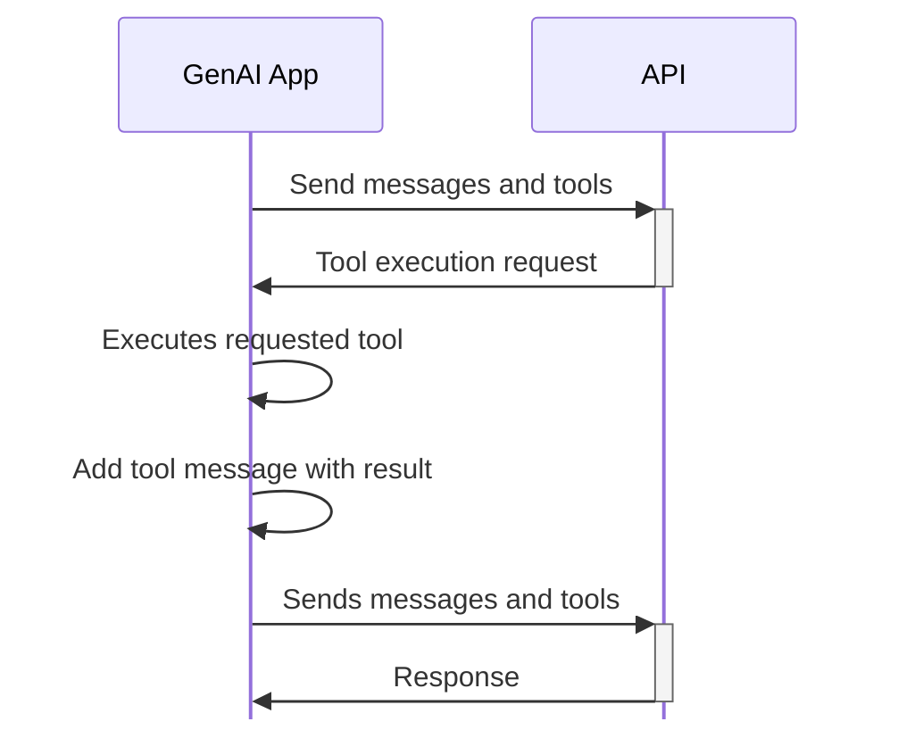

# Tools

_Tools_ provide the ability for LLMs to _do_ something, rather than simply answer a question based on the information it was trained on.

Some use cases might include:

- Get the current time (what we'll try in just a moment)
- Look up data in a database
- Take screenshots of websites, decipher what's on it, and ask questions about it
- And more!

> [!info] Important note
> Not _all_ models support tool calling. Be sure to do your research with the model you're using if things aren't working as expected.
>
> Additionally, because tool calling requires smarter models, using a model with fewer parameters or different quantization levels may affect its ability to invoke tools.

## The tool request flow

Before jumping into the technical details, we'll take a look at the actual execution flow. The flow will look something like this:

1. The GenAI app sends a collection of `messages` to the LLM (just as before). But, we now also specify a collection of available `tools` that can be used by the LLM.
2. The LLM returns an `assistant` message (just as before), but adds additional properties that indicate it wants to invoke a tool. It specifies the tool and required arguments.
3. The GenAI app then invokes the tool and collects the output.
4. That output is put into a `tool` message, added to the stack of messages, and sent back to the LLM.
5. The LLM evaluates the entire conversation and generates a response
    - The response could be another request to invoke a tool, starting the process over again

In a flowchart, it looks like this:



Now that we understand the flow, let's dive into how it actually looks through the API.


## Defining tools

The `/v1/chats/completion` endpoint allows for an additional `tools` property to be defined, which is the collection the LLM can use.

> [!tip] Function calling vs tool calling
> When the API was originally created, it used the term "function calling." Since then, the phrase has evolved to "tool calling" because not all tools may be a simple function invocation.

The following request now includes the `tools` parameter, which contains a description of a tool that provides the ability to get the current time.

```json with-copy highlight=10-28
curl -v {{ENDPOINT}} \
    -H "Content-type: application/json" \
    -X POST --data-raw '
{
  "model": "{{MODEL}}",
  "messages": [
    { "role": "system", "content": "You are a helpful agent" },
    { "role": "user", "content": "What is the current time in New York City?" }
  ],
  "tools": [
    {
      "type": "function",
      "function": {
        "name": "get-current-time",
        "description": "Get the current time for a specified timezone",
        "parameters": {
          "type": "object",
          "properties": {
            "timezone": {
              "type": "string",
              "description": "The requested timezone"
            }
          },
          "required": ["timezone"]
        }
      }
    }
  ]
}'
```

Note that the tool's description provides details on when the LLM should use the tool. The tool parameters then outline what arguments the LLM will need to provide in order to invoke the tool. In this case, the tool needs to know the requested timezone.

## Handling tool execution requests

If the LLM decides it needs to use a tool, it will add an additional `tool_calls` property to the generated message. Running the previous command will generate a message similar to this:

```json
{
  "role": "assistant",
  "content": null,
  "tool_calls": [
    {
      "id": "call_oz8QXTQqD6CKZj0q68FWVdmF",
      "type": "function",
      "function": {
        "name": "get-current-time",
        "arguments": "{\"timezone\":\"America/New_York\"}"
      }
    }
  ]
}
```

Note how the message specifies a random `id` for the tool request, the requested tool name, and the specified arguments.

When the application receives the message, it is up to the app to then invoke the tool, whether that's a local function call or a remote execution.

The response is packaged in another message that will be sent back to the LLM, using the `tool` role. In the message, the `id` of the requested execution is relayed back in the `tool_call_id` property, allowing the LLM to associate the tool request with the tool response.

The following command now adds both the `assistant` message that requested the tool invocation and the `tool` message that contains the tool output. Now, the LLM should have all the information it needs to answer the original question.

```json with-copy highlight=23-27
curl -v {{ENDPOINT}} \
    -H "Content-type: application/json" \
    -X POST --data-raw '
{
  "model": "{{MODEL}}",
  "messages": [
    { "role": "system", "content": "You are a helpful agent" },
    { "role": "user", "content": "What is the current time in New York City?" },
    { 
      "role": "assistant",
      "content": null,
      "tool_calls": [
        {
          "id": "call_oz8QXTQqD6CKZj0q68FWVdmF",
          "type": "function",
          "function": {
            "name": "get-current-time",
            "arguments": "{\"timezone\":\"America/New_York\"}"
          }
        }
      ]
    },
    {
      "role": "tool",
      "content": "2/19/2025, 4:50:24 PM",
      "tool_call_id": "call_oz8QXTQqD6CKZj0q68FWVdmF"
    }
  ]
}'
```


## Your task

For this section, you will experiment with using tools.

1. First, add a message that will ask the LLM for the current time in any location of your choosing.
    - The result you'll see is likely going to be the time in which the model was trained. Cool, huh?
2. In the **Tools** tab, add the time tool using the **+ Add time tool** button. 
    - Feel free to click on the tool to view the actual tool description and parameters.
3. Ask for the current time in your requested location.
    - You should see the tool execution request, the tool output, and then the final response.

If you're feeling adventerous, click the **+ Add custom tool** button and make up your own tool! A fun idea is a tool that adds two numbers together, but does so incorrectly (says 2 + 2 is really 8).
